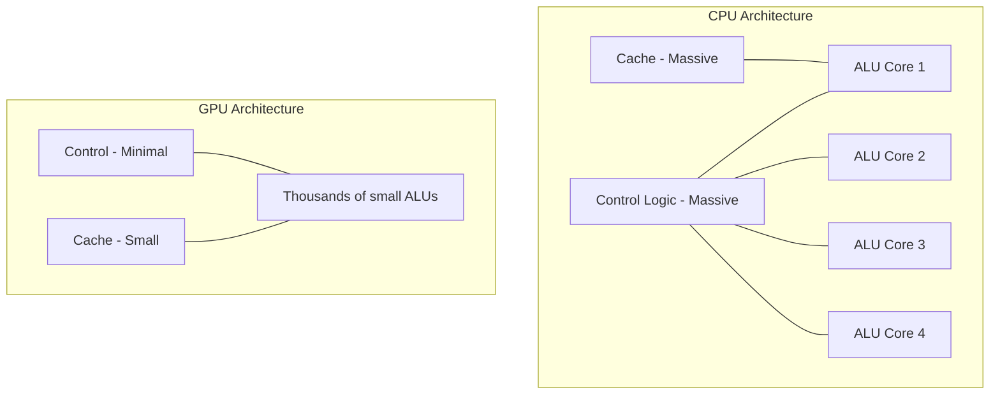
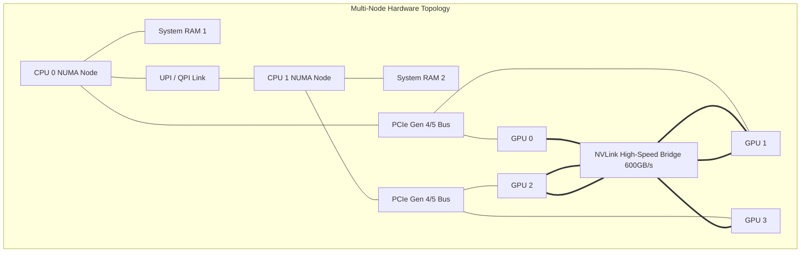

# 01. GPU Architecture Basics: Under the Silicon Hood

Before optimizing anything, we must understand physically how data moves through a chip. Treating a GPU simply as a "faster CPU" is the root cause of 90% of AI performance bottlenecks. 

---

## 🟢 Basics: CPU vs GPU Data Processing

How does a processor actually process data? The fundamental difference lies in **Latency vs. Throughput**.

### The CPU Approach (Low Latency, Sequential)
A Central Processing Unit (CPU) is built to execute a single thread of instructions as fast as physically possible. 
*   **Architecture:** It has a massive Cache (L1/L2/L3) and highly complex control logic (branch prediction, out-of-order execution) to ensure the current thread never waits.
*   **Analogy:** A CPU is like a Ferrari. It can move 2 passengers from point A to point B incredibly quickly.

### The GPU Approach (High Throughput, Parallel)
A Graphics Processing Unit (GPU) is built to execute thousands of simple threads simultaneously. 
*   **Architecture:** It sacrifices single-thread speed and complex control logic in favor of packing thousands of Arithmetic Logic Units (ALUs). 
*   **Analogy:** A GPU is like a heavy freight train. It takes a while to load (memory transfer) and get moving, but it can transport 10,000 passengers at once.



### The AI Connection
Deep learning is fundamentally just massive matrix multiplications. While a CPU calculates $A \times B$ sequentially cell by cell, a GPU calculates the entire matrix simultaneously.

---

## 🟡 Intermediate: The GPU Hardware Landscape

Not all GPUs are created equal. The AI industry is dominated by specific architectural designs.

### Consumer vs. Enterprise NVIDIA GPUs
*   **Consumer (RTX 4090):** Designed for gaming. Outstanding raw compute, but lacks NVLink (multi-GPU communication), restricts P2P PCIe transfers, and has standard GDDR memory. It cannot be easily clustered.
*   **Enterprise (A100 / H100):** Designed for data centers. Built with HBM (High Bandwidth Memory) physically integrated into the chip, NVLink for 900+ GB/s GPU-to-GPU sync, and specialized Tensor Cores.

### Non-NVIDIA Alternatives
*   **Google TPUs (Tensor Processing Units):** Application-Specific Integrated Circuits (ASICs) built *only* for AI. They use a systolic array architecture where data flows continuously through ALUs in waves, completely bypassing registers.
*   **AMD Instinct (MI300X):** AMD's competitor to the H100, featuring massive memory bandwidth and capacity (192GB vs 80GB), utilizing the ROCm software stack instead of CUDA.
*   **Intel Gaudi:** Specialized deep learning accelerators focusing heavily on integrated ethernet for frictionless scaling across networking racks.

---

## 🔴 Advanced: Threads, Warps, and Hardware Topologies

If you are an engineer writing PyTorch or managing Kubernetes, you must understand the exact path the silicon takes when executing your code.

### 1. Execution Flow: Kernel to Silicon
When PyTorch calls `torch.matmul()`, the framework sends a **Kernel** (a C++ script) to the GPU.
1. The GPU scheduler divides the task into a **Grid** of **Thread Blocks**.
2. These blocks are assigned to a **Streaming Multiprocessor (SM)**. An H100 has 132 SMs.
3. Inside the SM, threads are executed in groups of exactly 32, called a **Warp**.

> [!WARNING]
> **Warp Divergence:** The SM issues ONE instruction to all 32 threads in a Warp. If your code has an `if/else` statement, and 16 threads take `if` while 16 take `else`, the hardware must execute the `if` synchronously, masking out half the threads, and then execute the `else` synchronously, masking the other half. Your performance is instantly halved.

### 2. The Silicon Path: `nvidia-smi topo -m`
When training a multi-billion parameter model, one GPU is not enough. You must use multiple GPUs synced via PyTorch `DistributedDataParallel`. The physical wiring between these GPUs dictates whether your job finishes in 2 days or 2 months.

To view your topologies, run:
```bash
nvidia-smi topo -m
```



**Decoding the Network:**
*   **PCIe Bottleneck:** If GPU0 needs to talk to GPU2 but no NVLink exists, the data travels up PCIe1, across the QPI link to CPU1, and down PCIe2. Bandwidth drops from 600GB/s to 32GB/s.
*   **NUMA Thrashing:** If Dataloader processes on `CPU0` try to load data into `GPU2`, the CPU must constantly traverse the QPI link. **Expert Fix:** Always use `taskset` or container CPU pinning to bind GPU workloads exclusively to the CPU socket they physically report to.
