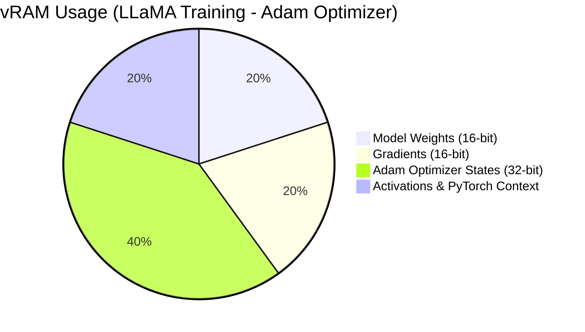

# 02. GPU AI Workloads & Utilization

Knowing how a GPU is built is only half the battle. The other half is understanding exactly how an AI workload claims memory inside the silicon. Most "Out of Memory" (OOM) errors in production are not caused by the model being too big, but by the infrastructure around the model wasting space.

---

## 🟢 Basic: The Anatomy of vRAM

When you load a PyTorch or TensorFlow model onto a GPU, it does not just load the file. It reserves multiple massive memory blocks.

### The Precision Problem
AI parameters are stored as floating-point numbers. The precision of these numbers dictates your exact vRAM footprint:
*   **FP32 (Single Precision):** Takes **4 bytes** per parameter. Highly accurate, but massive. Rarely used in modern AI.
*   **FP16 / BF16 (Half Precision):** Takes **2 bytes** per parameter. The industry standard for training. BF16 prevents data from overflowing boundaries during heavy math.
*   **INT8 / INT4 (Quantized):** Takes **1 byte or 0.5 bytes** per parameter. Used for Inference. This crushes the model size but requires mathematical calibration to maintain accuracy.

*Basic Rule of Thumb:* A 7-Billion parameter LLaMA model in FP16 will consume roughly 14GB of vRAM just to exist on the GPU.

---

## 🟡 Intermediate: Training vs. Inference Lifecycles

Training a model and serving a model require completely opposite strategies.

### The Training Footprint
Training requires memory for the backward pass.
1.  **Model Weights (Parameters):** 1x the model size.
2.  **Gradients:** Needed to calculate loss. 1x the model size.
3.  **Adam Optimizer States:** Maintains moving averages of the gradients. It stores these in FP32, making it consume **2x to 3x** the model size.
4.  **Activations:** Intermediate outputs saved during the forward pass. This scales linearly with Batch Size and Sequence Length.



### The Inference "KV Cache" Bottleneck
Inference generates text autoregressively (one word at a time). To predict the 1,000th word, the model must pay "attention" to the 999 previous words.
Instead of recalculating the math for all 999 words on every single step, it saves the mathematical outputs (the `Keys` and `Values`) of past words in memory. This is the **KV Cache**.

If you serve a large context window (e.g., analyzing a 100-page PDF), the KV Cache footprint will rapidly surpass the size of the Model Weights themselves, crashing your inference endpoint.

---

## 🔴 Advanced: Deep Profiling (Moving beyond `nvidia-smi`)

If your model is running slowly, the worst thing you can do is check `nvidia-smi` and assume it is doing its job.

### The `nvidia-smi` Utilization Lie
`GPU-Util` in `nvidia-smi` only measures the percentage of time during the past second that *one or more kernels were executing on the GPU*.
If only 1 single CUDA core out of 10,000 is running a `while(True)` loop, GPU-Util will show 100%. 

To find the truth, you must profile the **Streaming Multiprocessors (SMs)** directly.

### Deep Trace with Nsight Systems (`nsys`)
NVIDIA Nsight Systems provides a graphical timeline of exactly what the CPU, GPU, and PCIe bus are doing millisecond-by-millisecond.

```bash
# Profile a PyTorch training run
nsys profile --trace=cuda,cudnn,cublas,osrt -o out_profile python train.py
```

```mermaid
gantt
    title Nsight Timeline (I/O Starved GPU)
    dateFormat  s
    axisFormat  %S
    
    section CPU
    Dataloader Reading Disk :a1, 0, 3s
    Dataloader Reading Disk :a2, 4, 3s
    
    section GPU (CUDA)
    Waiting (Empty space)     :b1, 0, 3s
    Executing Matrix Math   :active, b2, 3, 1s
    Waiting (Empty space)     :b3, 4, 3s
    Executing Matrix Math   :active, b4, 7, 1s
```



**Diagnosing the Timeline:**
If you look at the timeline in the Nsight GUI and see "white space" between the GPU compute blocks (like the diagram above), your GPU is starving. It is computing the math in 1 second, but waiting 3 seconds for the CPU to read the next batch of images/text from the NVMe disk. 

**Expert Fix:**
Do not tune the GPU. Tune the CPU. Increase PyTorch's `DataLoader(num_workers=8)` or implement **NVIDIA DALI** to move data decoding (like JPEG decompression) directly onto the GPU hardware decoders, bypassing the CPU bottleneck entirely.
