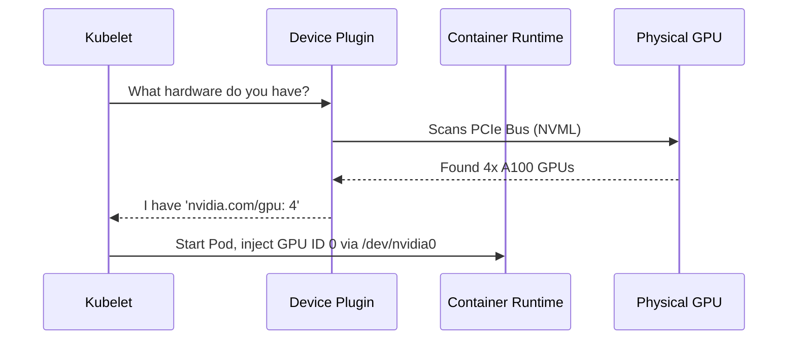

# 04. GPU Kubernetes Orchestration

Kubernetes fundamentally revolves around standardizing CPUs and RAM via cgroups. GPUs, however, are massive hardware blobs that do not cleanly conform to the standard cgroup isolation model. Orchestrating them correctly demands complex topological awareness.

---

## 🟢 Basic: How Kubernetes Sees GPUs

Out of the box, Kubernetes does not know what a GPU is. You cannot naturally request `nvidia.com/gpu: 1` in a Pod YAML. 

To bridge this gap, we deploy the **NVIDIA GPU Operator**. 



By default, standard Kubernetes treats a GPU as an *integer*. You request `1` GPU, you get the whole 80GB card. K8s does not natively understand GPU memory sharing.

---

## 🟡 Intermediate: Slicing the GPU

If a developer requests a GPU for an IDE session but only uses 4GB of vRAM, an entire 80GB resource is wasted. We must slice the GPUs.

### Time-Slicing (Software Level)
You configure the Device Plugin to lie to Kubernetes and say the node has `10` GPUs when it physically has `1`.
*   **Pros:** Easy to set up.
*   **Cons:** No hardware isolation. Workload A can OOM and crash Workload B because they share the same physical memory space. 

### Multi-Instance GPU - MIG (Hardware Level)
MIG physically partitions Hopper/Ampere GPUs into isolated instances at the hardware level. Each gets its own L2 cache, memory bandwidth, and compute logic. Zero cross-talk.

```mermaid
graph TD
    subgraph A100 GPU 80GB
        subgraph MIG Slice 1 (10GB)
            M1[Compute] --- L1[Cache/Memory]
        end
        subgraph MIG Slice 2 (10GB)
            M2[Compute] --- L2[Cache/Memory]
        end
        subgraph MIG Slice 3 (20GB)
            M3[Compute] --- L3[Cache/Memory]
        end
        subgraph MIG Slice 4 (40GB)
            M4[Compute] --- L4[Cache/Memory]
        end
    end
```

---

## 🔴 Advanced: K8s YAML Configurations

### 1. Automating K8s MIG Geometries
To slice an A100 using the GPU Operator, you inject a ConfigMap containing the requested geometry.

```yaml
apiVersion: v1
kind: ConfigMap
metadata:
  name: default-mig-parted-config
  namespace: gpu-operator
data:
  config.yaml: |
    version: v1
    mig-configs:
      all-3g.40gb:
        - devices: all
          mig-enabled: true
          mig-devices:
            "3g.40gb": 2 # Cuts an 80GB card into two perfect 40GB halves
```
The Device Plugin will now advertise `nvidia.com/mig-3g.40gb: 2` to K8s. 

### 2. MPI Operator for Distributed Training
Deploying a multi-node LLaMA fine-tuning job is not as simple as deploying a K8s `Deployment`. All pods must startup simultaneously, exchange SSH keys, and be topologically co-located.

**Kubeflow's MPI Operator** handles this via a Custom Resource Definition (CRD).

```yaml
apiVersion: kubeflow.org/v2beta1
kind: MPIJob
metadata:
  name: distribute-llama-training
spec:
  slotsPerWorker: 8 
  mpiReplicaSpecs:
    Worker:
      replicas: 4 # 4 physical Nodes needed
      template:
        spec:
          affinity:
            podAffinity:
              requiredDuringSchedulingIgnoredDuringExecution:
              - labelSelector:
                  matchExpressions:
                  - key: app
                    operator: In
                    values: ["distribute-llama-training"]
                topologyKey: topology.kubernetes.io/zone
          containers:
          - image: enterprise-ai/trainer:v1
            name: mpi-worker
            resources:
              limits:
                nvidia.com/gpu: 8 
                rdma/hca: 1 # Demands access to the InfiniBand NIC
```

**Key Note on Topology:** The `podAffinity` block above uses `topology.kubernetes.io/zone`. If the K8s scheduler places nodes across different Availability Zones, the latency over the cross-AZ fiber optic lines will destroy your TFLOPS. You must enforce scheduling on the exact same Top-of-Rack network switch.
