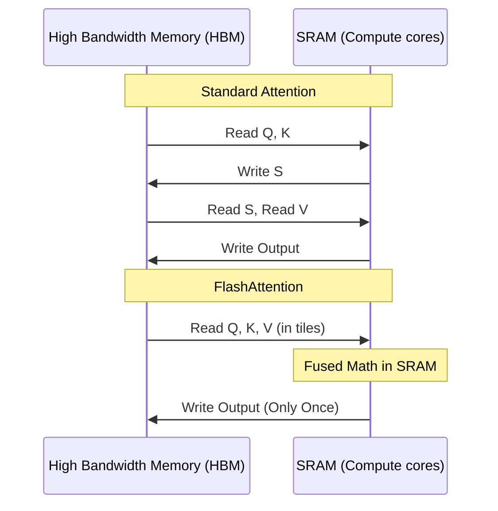

# 05. Advanced Optimizations

If your infrastructure is perfect, network is humming, and hardware is healthy, how do you make the code itself run 4x faster without buying more compute? Welcome to the bleeding edge of MLOps logic.

---

## 🟢 Basic: The Memory Wall

The single biggest enemy of AI performance is the time it takes to move data from the GPU's memory (HBM) to the GPU's compute cores (SRAM). 

**The Memory Wall:** If a mathematical operation is simple (like adding two numbers), the GPU calculates the answer instantly, but spends a long time fetching the next two numbers from memory. The GPU is "Memory Bound".

Most deep learning layers (especially standard Attention mechanisms) are heavily memory-bound.

---

## 🟡 Intermediate: Inference Servers & PagedAttention

Serving an LLM to thousands of users simultaneously using standard PyTorch `model.generate()` is criminally slow. You must use a specialized inference server.

### The Problem with Standard Inference
In standard text generation, PyTorch allocates a massive contiguous block of memory for the maximum possible context length (e.g., 4096 tokens) for the **KV Cache**. If a user only chats for 10 tokens, 99.7% of that memory sits physically empty but "locked." 

### The vLLM Solution (PagedAttention)
vLLM borrows OS Virtual Memory logic. It partitions the KV cache into small blocks (e.g., chunks of 16 tokens). Memory is allocated dynamically on-demand from a centralized memory pool.

```mermaid
graph TD
    subgraph Standard KV Cache (Wasteful)
        S1[User 1: Token 1..10 (Active)] --- S2[Token 11..4096 (Reserved & Empty)]
    end

    subgraph PagedAttention (vLLM)
        V1[User 1: Block 1] --- P[Centralized Memory Pool]
        V2[User 2: Block 1] --- P
        V3[User 3: Block 1] --- P
    end
```
*   **Result:** Memory waste drops from 60% to <4%. You can fit 4x as many concurrent users onto the same GPU.

---

## 🔴 Advanced: FlashAttention & ZeRO-3 Offloading

### 1. FlashAttention
Standard self-attention memory complexity scales quadratically ($O(N^2)$). The GPU constantly evicts and re-loads matrices back and forth between HBM and SRAM.

**FlashAttention** uses algorithmic "tiling." It loads blocks of Query, Key, and Value data into SRAM, fuses the entire attention calculation (matrix multiply, scale, mask, softmax) directly inside the SRAM, and writes the final output back to HBM exactly *once*.


*   **Impact:** Massive speedup on long context lengths with zero degradation in mathematical accuracy.

### 2. DeepSpeed ZeRO-3
When a model (like LLaMA 70B) is larger than a single nodes VRAM, standard Distributed Data Parallel completely fails. 

**DeepSpeed by Microsoft** implements the **ZeRO (Zero Redundancy Optimizer)**. 
Instead of every GPU holding a full copy of the model weights, ZeRO fragments the model across the cluster.

If GPU-0 is computing Layer 1, it holds Layer 1. If it needs Layer 2, it fetches it rapidly via NVLink broadcast from GPU-1 on-the-fly.

**Enterprise `zero_stage_3` JSON Config:**
```json
{
  "fp16": {
    "enabled": "auto"
  },
  "zero_optimization": {
    "stage": 3,
    "overlap_comm": true,
    "contiguous_gradients": true,
    "sub_group_size": 1e9,
    "reduce_bucket_size": "auto",
    "stage3_prefetch_bucket_size": "auto",
    "stage3_param_persistence_threshold": "auto",
    "stage3_max_live_parameters": 1e9,
    "stage3_gather_16bit_weights_on_model_save": true
  },
  "train_batch_size": "auto"
}
```
**Pro-Tip:** Enabling `"overlap_comm": true` is critical. It hides network transfer latency by fetching layer $N+1$ across the NVLink network *while* the GPU is actively computing layer $N$.
